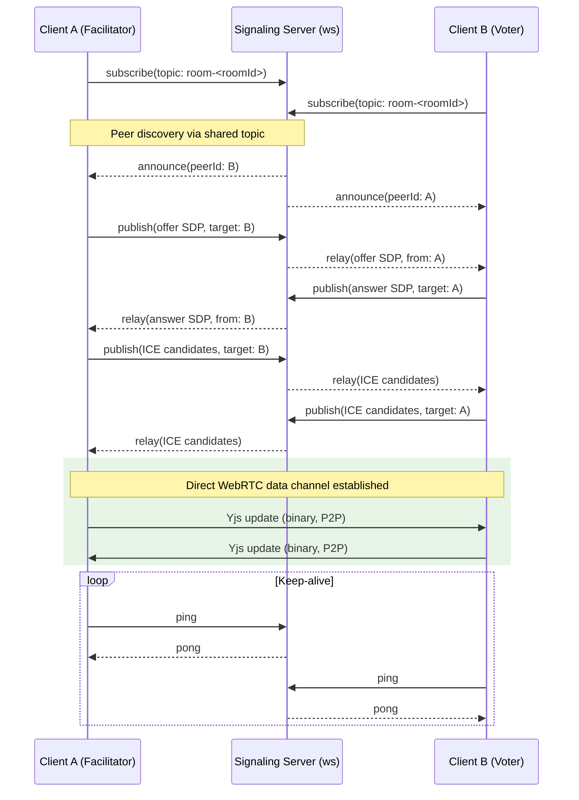
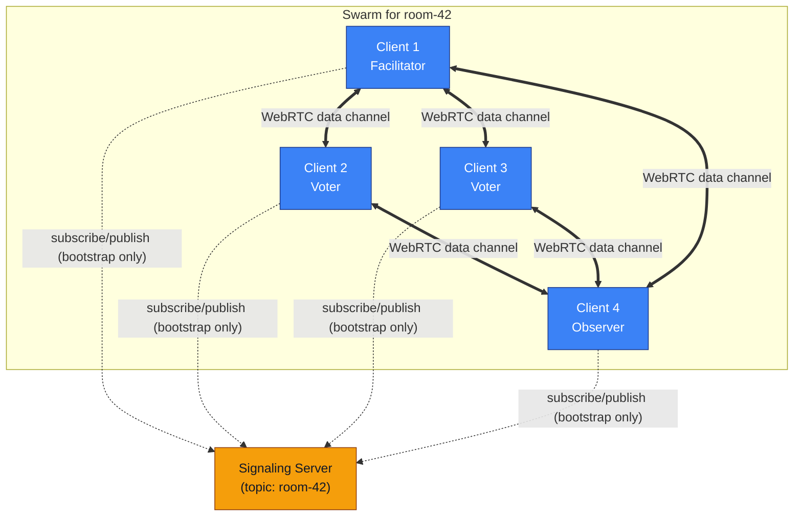

# ADR 000: Decentralized Project Planning App

## Status
Proposed

## Context
Remote teams often estimate work in fragmented tools (video call + ticket tracker + chat), creating process overhead and weak session records. We want a focused, real-time planning poker application for distributed teams that supports anonymous voting, simultaneous reveal, and low operational overhead.

A key architectural constraint is to avoid a custom backend/database for application state. Instead, the app is local-first: each client holds the full room state and changes are merged automatically across peers. This ADR captures the decision to build the app on a CRDT (Yjs) data model synchronized peer-to-peer over WebRTC, with a minimal signaling service used only to help peers discover each other.

## Decision
We will build the client as a React + TypeScript + Vite single-page app whose source of truth is a Yjs (`Y.Doc`) CRDT document, synchronized between participants via WebRTC (`y-webrtc`), with a lightweight custom signaling server used solely for connection bootstrap, and IndexedDB used for local persistence/session restore.

### 1. CRDT State Management
- The Yjs document (`Y.Doc`) is the single source of truth for room state. There is no server-side database; all state lives in-browser and is merged conflict-free across peers.
- State is organized under a top-level `shared` `Y.Map` (see [src/utils/crdt.ts](../src/utils/crdt.ts)) containing typed sub-collections: `room`, `users`, `votables`, `votes`, and `uiState`.
- All state mutations go through small, named functions (`createRoomState`, `upsertUser`, `addVotable`, `submitVote`, `revealVotes`, `resetVotes`, `finalizeEstimate`, etc.) that wrap changes in `ydoc.transact(...)` so each logical action is applied atomically and produces a single merge-friendly update.
- A `CRDTAction` discriminated union (see [src/types/index.ts](../src/types/index.ts)) provides a reducer-style dispatch surface (`CRDTReducer`) so UI code issues intent (e.g. `{ type: 'submitVote', payload }`) rather than mutating Yjs types directly.
- Presence (who is online) is tracked via the Yjs Awareness API in combination with an explicit `online` flag on `User` records, so refreshes/disconnects degrade to "offline" rather than removing history.
- Local persistence and refresh recovery is handled by `y-indexeddb` (`IndexeddbPersistence`), giving each browser tab a durable local replica that resyncs automatically when peers reconnect.
- Conflict resolution is delegated to Yjs's CRDT algorithms (last-writer-wins per field for `Y.Map` values, sequence CRDT for `Y.Array` ordering of `votables`), which avoids the need for custom merge logic.

### 2. Signaling Service
- WebRTC requires an out-of-band channel to exchange connection offers/answers between peers before a direct P2P channel exists; we run a small custom signaling server for this purpose (see [server/index.js](../server/index.js)) rather than depending on a public/shared signaling instance.
- The server is a plain Node.js `ws` WebSocket server implementing the `y-webrtc` signaling protocol: clients `subscribe`/`unsubscribe` to topic names (derived from the room ID) and `publish` messages that are fanned out to other subscribers of the same topic; a `ping`/`pong` keep-alive prevents idle disconnects.
- The signaling server holds no room/session state — it only relays connection-establishment messages (`topics: Map<topic, Set<connection>>` in memory) and can be restarted at any time without any data loss, since it is not part of the CRDT source of truth.
- Once peers establish a WebRTC data channel, all further state sync (Yjs updates) flows directly peer-to-peer; the signaling server is not on the path for room data.
- This keeps the only server-side component minimal, stateless with respect to application data, and cheap to host (see [adr/001-infrastructure-hosting-strategy.md](001-infrastructure-hosting-strategy.md) for hosting decisions).

#### Connection bootstrap sequence

The signaling server is only involved in the initial handshake. Once the WebRTC data channel is established, updates flow directly between clients and the signaling server drops out of the data path:

#### Swarm topology across a room

`y-webrtc` organizes all clients subscribed to the same room topic into a mesh "swarm." Every client maintains direct data-channel connections to (a subset of) its peers, so CRDT updates gossip through the mesh without any single client or server being a bottleneck:

Each room forms its own independent swarm (isolated by topic name), so multiple concurrent planning sessions share the same signaling server without their CRDT updates crossing over.

### 3. State Schema
Core types (see [src/types/index.ts](../src/types/index.ts)):

- `Room`: `id`, `name`, `facilitator: User`, `voters: User[]`, `observers: User[]`, `votables: Votable[]`, `status: 'active' | 'paused' | 'ended'`, `createdAt`, optional `passphrase`.
- `User`: `id`, `name`, `profileIcon`, `role: 'facilitator' | 'voter' | 'observer'`, `online`, `joinedAt`.
- `Votable` (backlog item): `id`, `name`, optional `link`/`description`, `votes: Vote[]`, optional `finalEstimate`, `status: 'pending' | 'estimating' | 'estimated'`.
- `Vote`: `id`, `userId`, `votableId`, `score: string | number`, `createdAt`.
- `CRDTState` (typed view over the Yjs document): `room: Room`, `users: Map<string, User>`, `votables: Votable[]`, `votes: Map<string, Vote>`, `uiState: Map<string, unknown>`.
- `uiState` keys of note: `activeVotableId` (currently active backlog item) and `reveal:<votableId>` (per-item reveal flag/attribution).
- Card deck values are fixed: `CARD_VALUES = ['1','2','3','5','8','13','21','34','55','89','?','☕','🚫']` (Fibonacci plus unknown/coffee/break).
- Client intents are modeled as a `CRDTAction` union (`createRoom`, `upsertUser`, `joinAsVoter`, `joinAsObserver`, `removeUser`, `markUserOffline`, `addVotable`, `editVotable`, `removeVotable`, `reorderVotable`, `submitVote`, `revealVotes`, `resetVotes`, `finalizeEstimate`, `setActiveVotable`), keeping the schema and the set of valid mutations co-located and type-checked.

### 4. Debugging
- **Client-side event/error logging**: [src/utils/telemetry.ts](../src/utils/telemetry.ts) records a rolling log (max 500 entries) of `AnalyticsEvent`s to `localStorage` (`planning-poker:analytics-events`), via `trackEvent`/`trackError`. On `localhost`/`127.0.0.1` these are also mirrored to `console.info`/`console.error` for real-time inspection during development.
- **Yjs document inspection**: because `CRDTState` and `SharedCollections` expose typed handles to the underlying `Y.Map`/`Y.Array` instances, developers can inspect live document contents directly from the browser console (e.g. via `ydoc.getMap('shared').toJSON()`) to compare local state against expectations without extra tooling.
- **IndexedDB persistence**: `y-indexeddb` snapshots can be inspected via browser devtools (Application > IndexedDB) to debug refresh/reconnect behavior and confirm local replicas match peer state.
- **Signaling server logs**: the signaling server logs subscribe/unsubscribe activity and connection errors to stdout, which is sufficient to diagnose peer discovery/connection-establishment issues independent of CRDT data issues.
- **Known debugging gaps (follow-up work)**: no structured/remote error reporting service is wired up yet (telemetry is local-only); there is no CRDT update/version history viewer; WebRTC connection-state (ICE candidate failures, negotiation stalls) is not currently surfaced in the UI and requires browser `chrome://webrtc-internals`-style inspection.

## Consequences
- No custom application database or REST/WebSocket state API is required, reducing operational surface area and cost.
- All conflict resolution relies on Yjs semantics; developers must model state changes as CRDT-friendly operations (whole-value replacement on `Y.Map` entries, array splice operations) rather than arbitrary mutations.
- The signaling server is a single point of failure for *new* connections (peers who are already connected keep syncing without it), so it should be deployed with restart/availability in mind, but does not require data backup since it is stateless.
- Debugging distributed CRDT state is inherently harder than debugging a central database; the lack of remote telemetry and CRDT history tooling is an accepted MVP gap to be revisited in Phase 2 hardening.
